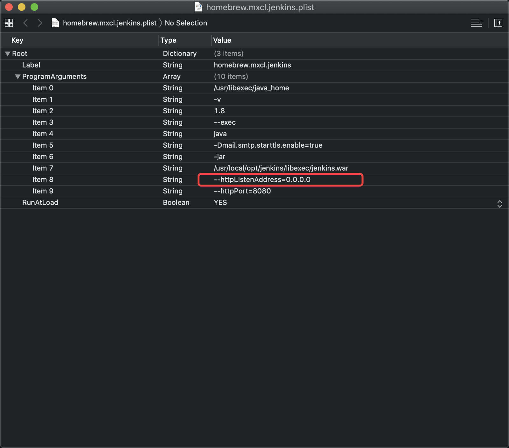

# Jenkins踩坑记录

#### 1、`homebrew`安装的`Jenkins`无法通过`IP`访问

这是因为`brew`把`jenkins`启动的监听地址设置为了`127.0.0.1`，改为`0.0.0.0`即可实现访问

`jenkins`配置所在路径：`~/Library/LaunchAgents/homebrew.mxcl.jenkins.plist`



#### 2、`jenkins`脚本中无法使用`pod`、`brew`等命令

需要在脚本开头添加 `-l`

```bash
#!/usr/bin/env sh -l

export LANG=en_US.UTF-8
export LANGUAGE=en_US.UTF-8
export LC_ALL=en_US.UTF-8
```

#### 3、构建中生成的数据无法传递给构建阶段

解决：把数据写入文件，然后通过Jenkins种的`FILE`获取

写文件

```bash
# 创建下载地址日志文件
download_urls="${EXPORT_DIR}/DownLoadURLs.log"
if [[ ! -f ${download_urls} ]]; then
	touch ${download_urls}
fi
# 清空文件
echo "" > ${download_urls} 
echo "包名称：${application_name} <br/>" >> ${download_urls}
```

读文件

```bash
Jenkins打包结果：<br/><hr/>
 ${FILE, path="${PACKAGE_DIR}/${branch}/Package/DownLoadURLs.log"}  <br/><hr/>
项目名称：$PROJECT_NAME<br/><hr/>
构建编号：$BUILD_NUMBER<br/><hr/>
构建状态：$BUILD_STATUS<br/><hr/>
触发原因：${CAUSE}<br/><hr/>
构建日志地址：<a href="${BUILD_URL}console">${BUILD_URL}console/</a><br/><hr/>
构建地址：<a href="$BUILD_URL">$BUILD_URL</a><br/><hr/>
变更集:${JELLY_SCRIPT,template="html"}<br/><hr/>
```

#### 4、自动输入

比如自动输入 `Y`

```bash
# 输入一次
echo Y

# 输入任意次
yes Y
```

#### 5、填充密码

使用`echo` 加 `-S` 解决

```bash
echo "密码" | sudo -S gem install cocoapods
```

#### 6、从构建日志中过滤日志

比如修改构建名称和构建描述
```bash
# 构建名称（编号 + 分支 + 当前登录用户）
${BUILD_NUMBER}_${branch##*/}_${BUILD_LOG_MULTILINE_REGEX,showTruncatedLines="false", maxMatches=1,regex="Started by user.*"}
# 从构建日志中提取描述
${BUILD_LOG_MULTILINE_REGEX,showTruncatedLines="false", regex="BID:.*|Version:.*|commitId:.*"}
```

获取登录用户名的另一种方式，需要打开`Set jenkins user build variables`

```bash
#${BUILD_NUMBER}_${PROJECT_BRANCH}_${BUILD_USER}
```

### Jenkins插件推荐

插件镜像： http://mirror.esuni.jp/jenkins/updates/update-center.json

- Extented Choice Parameter Plugin-In
- Git Parameter Plug-In
- List Git Branches Parameter
- Environment Injector
- Credentials Plugin
- CocoaPods  Jenkins Integration
- Keychains and Provisioning Profiles Management
- Xcode Integration
- Gitlab Authentication plugin
- Gitlab Hook Plugin
- Safe Restart Plugin

### Shell Tips：

1. 执行出错时自动执行后面的命令（`||`）： `xcodebuild archive || echo "执行失败"`

2. 设置默认值：`PROJECT_DIR=${project_path:-$WORKSPACE}` #如果参数未设置取默认值


### 参考资料：

- [Updating Homebrew’s “httpListenAddress” Default for Jenkins](http://mikezornek.com/posts/2013/11/updating-homebrews-httplistenaddress-default-for-jenkins/)
- [Shell 十三问](https://wiki.jikexueyuan.com/project/13-questions-of-shell/eight.html)