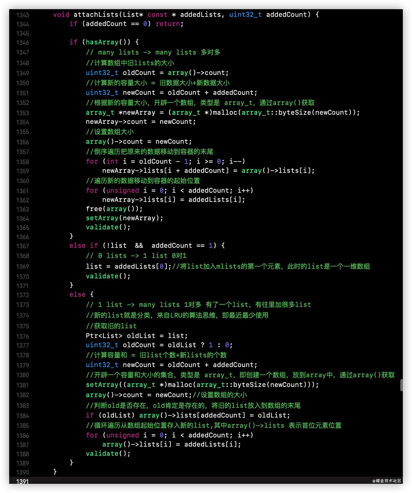
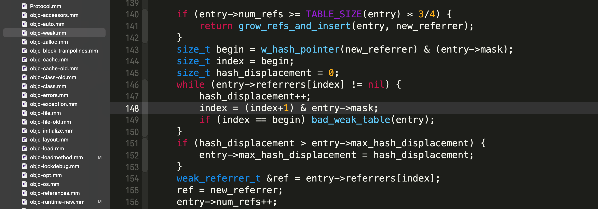
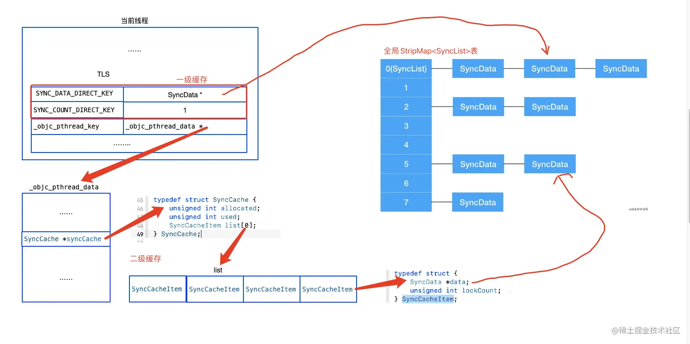
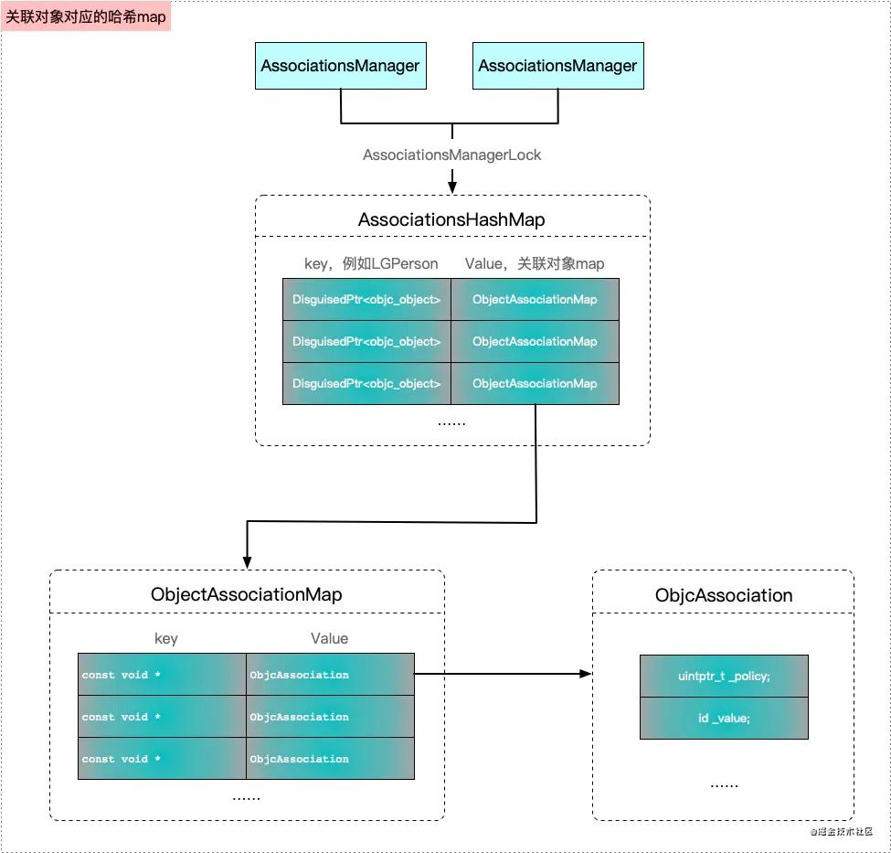

## iOS源码阅读笔记

## Runtime

`AutoreleasePoolPage` 、`SideTableMap`、`AssociationsManager` 是在`map_images->map_images_nolock->arr_init()` 函数中初始化的；

一个类最多能添加`64`个分类；

#### 为什么会有一块干净的内存和一块脏内存呢？

 这是因为`iOS`运行时会导致不断对内存进行增删改查，会对内存的操作比较严重，为了防止对原始数据的修改，所以把原来的干净内存`copy`一份到`rw`中，有了`rw`为什么还要`rwe`（脏内存），这是因为不是所有的类进行动态的插入、删除。当我们添加一个属性，一个方法会对内存改动很大，会对内存的消耗很有影响，所以我们只要对类进行动态处理了，就会生成一个`rwe`。
	
	
#### 为什么category会覆盖原来的方法？

在`map_images`方法的 `attachCategories -> attachLists` 分类附加到原来的类的方法列表时，会先重新开辟一个新的数组，把原来的方法列表倒序遍历添加到新数组的后面，接着再正序遍历，把分类的方法添加到新数组的前面（方法列表的顺序与原来的顺序一致）；



#### 类和category实现load对加载的影响

只有类和分类都实现`load`方法，才会发生在`load_image`阶段分类方法整合到所属类的方法列表中的操作; 只有类或者分类中实现`load`的时候，类的方法和分类方法都是直接在编译期存放到`class_ro_t`中的`baseMethods`中的。那这种情况怎么能保证分类方法在原始类方法前面的？这应该是编译器自己在编译期做的处理，让分类方法地址比原始类的方法地址要低（方法排序用的是升序排序）。

而对于类和分类都实现`load`的场景，即在`load_image`阶段把分类方法整合到类的方法列表中的情况是如何进行二分查找的呢？其实整合后的方法列表是个二维数组，内部存的是排好序的一维方法列表（`methodizeClass`阶段`preparemethod`进行的方法升序排序），方法查找时先是顺序遍历二维数组，再在有序的一维方法列表中进行二分查找。

综上所述，不要在类和分类中同时实现`load`方法也是提升启动速度的一个点，当然，不用`load`最好了。

## Weak

`weak_table_t` 是全局保存弱引用的哈希表，它是通过对`object`地址做`hash`计算，然后从`8`个`SideTable`数组中取出其中一张，然后再从`SideTable`中读取到`weak_table`。`weak_table_t` 是以 `object` 地址为 `key`，以 `weak_entry_t` 为 `value`。

`weak_entry_t` 是用来存储所有指向某个对象的弱引用变量的地址的，里面有个`weak_referrer_t`数组，它存储的其实是弱引用的指针，即指针的指针，这么做的目的是可以把弱引用置为`nil`。

`weak_entry_t` 中有`2`种结构，当存储的弱引用数量`<= 4`个的时候用的其实是个定长数组，`> 4`的时候才会转为哈希数组。（这里使用哈希数组的原因应该是为了处理B弱引用A，然后B先释放了，这时那个弱引用可能也要置为nil，用hash数组的话查询速度会比较快）。往`weak_entry_t` 中添加弱引用变量时，即更新`weak_referrer_t`采用的是定向寻址法；

往`weak_table` 中插入`weak_entry_t`时，先是对`object`地址取`hash`作为它的`index`，如果这个`index`下的位置不为空，则通过一个算法（`index = (index+1) & weak_table->mask`）重新计算生成一个新的`index`再读取对应的位置，直到找到一个空位置，然后把`weak_entry_t`放进去，同时更新元素数量。这种插入方式其实也是定向寻址法。


> hash 函数，与 mask 做与操作，防止 index 越界;

```c
size_t begin = hash_pointer(referent) & weak_table->mask;
```




`weak_table_t` 还有一个扩容和缩容的处理，当前使用容量占到 总容量`（mask + 1） 3/4` 的时候会进行扩容处理，扩大到现有总容量`（mask + 1）`的`2`倍。 当总容量超过`1024`，而实际使用的空间低于总空间的 `1/16` 时则会进行容量压缩，缩到现有总容量的`1/8` （为什么是八分之一？是为了保证总容量是现有使用容量的`2`倍）。

## @synchronized原理

1. 先从当前线程的`TLS`中尝试获取`SyncData`（本身是个单向链表），如果存在并且`SyncData`中的`object`与传进来的`object`相同，则说明找到对应的`SyncData`了。更新锁数量（`lockCount`），并返回`SyncData`。
    
    （注意：一条线程的`TLS`中只能存唯一一个`SyncData`，假如已经存在了但是`object`并不与自己传进来的一致，则创建新的`SyncData`后并不会更新到`TLS`中，而是保存到 `pthread_data` 中，有点先入为主的意思）

2. 从`pthread_data`中获取`SyncCache`（里面存着一个`SyncCacheItem`数组，`SyncCacheItem`存的是`SyncData`），如果存在则遍历`SyncCacheItem`数组，如果`cacheItem`中的`syncData`中的`object`与传进来的`object`相同，则更新 `item->lockCount` ，然后返回`SyncData`。

3. 走到这里就说明没有从`thread cache`中找到合适的`SyncData`。这时就会从全局`StripMap<SyncList> sDataLists` 表中读取，先通过对象`object`的`hash`值取出一个`SyncList`，接着拿到`SyncList`中的`SyncData`链表，然后遍历整个链表。

	a. 如果发现与`object`匹配的`SyncData`则更新`SyncData`中的`threadCount`数量，然后把找到的这个`SyncData`保存到`TLS`或者`pthread_data`中的`SyncCache`里面；

	b. 如果遍历到最后也没发现匹配的，则找到链表中第一个未使用（`SyncData`中的`threadCount = 0`）的`SyncData`，进行复用。这个`SyncData`也会和上面一样进行缓存；

	c. 如果没找到匹配的，也没找到未使用的，则创建一个新的`SyncData`。这个新的`SyncData`会先保存到`SyncList`中，然后也会和上面一样保存到`TLS`或者`pthread_data`中一份，即新创建的有2份缓存。

    

## Associate 原理

所有的关联对象都是由`AssociationsManager`管理的，`AssociationsManager`里面是由一个静态`AssociationsHashMap`来存储所有的关联对象。这相当于把所有对象的关联对象都存在一个全局`hashMap`里面，`hashMap`的`key`是这个对象的`指针地址`（任意两个不同对象的指针地址一定是不同的），而这个`hashMap`的`value`又是一个`ObjectAssociationsMap`，里面保存了关联对象的`key`和对应的`value`值。`runtime`的销毁对象函数`objc_destructInstance`里面会判断这个对象有没有关联对象，如果有会调用`_object_remove_assocations`做关联对象的清理工作。



## GCD

可创建的最大线程数是 `255`

```c
thread_pool_size = DISPATCH_WORKQ_MAX_PTHREAD_COUNT     255 
```
	
1. 自定义串行队列是`overcommit`的，并行队列不是`overcommit`的

2. 自定义队列的目标队列在初始化时传参为`NULL`，然后会为其从`_dispatch_root_queues` 中获取一个根目标队列；当 `tq` 为 `NULL`，即入参目标队列为 `DISPATCH_TARGET_QUEUE_DEFAULT`（值是` NULL`） 时， 根据 `qos` 和 `overcommit` 从 `_dispatch_root_queues` 全局的根队列数组中获取一个根队列作为新队列的目标队列

    ```objc
    if (!tq) {
        tq = _dispatch_get_root_queue(
                qos == DISPATCH_QOS_UNSPECIFIED ? DISPATCH_QOS_DEFAULT : qos,
                overcommit == _dispatch_queue_attr_overcommit_enabled)->_as_dq;
                
        if (unlikely(!tq)) {
            // 如果未取得目标队列则 crash
            DISPATCH_CLIENT_CRASH(qos, "Invalid queue attribute");
        }
    }
    ```

3. `dispatch_sync` :

    a. 首先将任务加入队列

    b. 执行任务`block`

    c. 将任务移除队列

    d. `sync`里面的处理最终执行的是`barrier`的内部函数

    e. 会死锁的原因是：执行时会检查当前线程的状态（是否正在等待），然后与当前的线程的ID（`_dispatch_tid_self()`）做比较，相等的话则判定为死锁。（相关处理在 `__DISPATCH_WAIT_FOR_QUEUE__` 函数中）

4. `dispatch_async`

    a. 将异步任务（`dispatch_queue 、 block`）封装为 `dispatch_continuation_t` 类型

    b. 然后执行 `_dispatch_continuation_async -> dx_push`递归重定向到根队列，然后通过创建线程执行 `dx_invoke` 执行`block`回调；

5. dispatch_barrier_async：

    a. 和`dispatch_async` 流程一样，只是里面有一个`while`循环，等队列中的`barrier`前面的任务执行完，才执行后面的
    b. 这里有个优化是：封装成 `dispatch_continuation_s` 结构时，会先从当前线程的`TLS`中获取一下，获取不到再从堆上创建新的

6. dispatch_group：

    a. `dispatch_group`内部维护着一个数值，初始值为`0`，`enter`时减`4`，`leave`时加`4`   https://juejin.cn/post/6902346229868019719#heading-4
	
    b. 等待用的是`while`循环，而不是信号量

7. dispatch_semaphore_t：

    a. dispatch_semaphore_wait 时里面其实是起了一个do-while循环，不断的去查询原子变量的值，不满足条件时会一直循环，借此阻塞流程的进行。有点像`dispatch_once`
	
8. dispatch_group_async：

    内部其实是对`dispatch_async` 和 `dispatch_group_enter / dispatch_group_leave` 的封装

9. 线程池复用原理：

    线程创建后从队列里取出任务执行，任务执行后使用信号量使其等待`5`秒钟，如果在这期间再有`GCD`任务过来，会先尝试唤醒线程，让它继续工作，否则等待超时后线程会自动结束，被系统销毁。（不是`tableview`中的复用池机制）


## NSTimer

#### timer添加到runloop的过程：

如果是`commonMode` ，会被添加到`runloop`持有的一个`_commonModeItems` 集合中， 然后调用 `__CFRunLoopAddItemToCommonModes` 函数，把`timer`添加到`runloopMode`对象持有的`_timers`数组中 ，同时也会把`modeName`添加到`runloopTimer`的 `_rlModes` 中，记录`runloopTimer`都能在哪种`runloop mode`下执行；
	
如果是普通`mode`，则先获取这个`runloopMode`对象，把`runloopMode`的`name`添加到`runloopTimer`持有的 `_rlModes`集合中，然后调用 `__CFRepositionTimerInMode` 函数，把`runloopTimer`插入`runloopMode`持有的 `_timers` 数组中（如果数组中已经存在了，则先做移除操作）；
	
上面添加完成后，会调用 `__CFRepositionTimerInMode` 函数，然后调用 `__CFArmNextTimerInMode`，再调用 `mk_timer_arm` 函数把 `CFRunLoopModeRef` 的 `_timerPort` 和一个时间点注册到系统中，等待着 `mach_msg` 发消息唤醒休眠中的 `runloop` 起来执行到达时间的计时器。（macOS 和 iOS 下都是使用 `mk_timer` 来唤醒 `runloop`）；
	
每次计时器都会调用  `__CFArmNextTimerInMode` 函数注册计时器的下次回调，休眠中的`runloop` 通过当前`runloop mode`的 `_timerPort` 端口唤醒，然后在本次`runloop`循环中在 `_CFRunloopDoTimers` 函数中循环调用 `__CFRunLoopDoTimer` 函数，执行达到触发时间的`timer`的 `_callout` 函数。
`__CFRUNLOOP_IS_CALLING_OUT_TO_A_TIMER_CALLBACK_FUNCTION__(rlt->_callout, rlt, context_info);` 是执行计时器的 `_callout` 函数。
	
	
#### NSTimer 不准时问题

通过上面的 `NSTimer` 执行流程可看到计时器的触发回调完全依赖 `runloop` 的运行（macOS 和 iOS 下都是使用 `mk_timer` 来唤醒 `runloop`），使用 `NSTimer` 之前必须注册到 `run loop`，但是 `run loop` 为了节省资源并不会在非常准确的时间点调用计时器，如果一个任务执行时间较长（例如本次 `run loop` 循环中 `source0` 事件执行时间过长或者计时器自身回调执行时间过长，都会导致计时器下次正常时间点的回调被延后或者延后时间过长的话则直接忽略这次回调（计时器回调执行之前会判断当前的执行状态 `!__CFRunLoopTimerIsFiring(rlt)`，如果是计时器自身回调执行时间过长导致下次回调被忽略的情况大概与此标识有关 ）），那么当错过一个时间点后只能等到下一个时间点执行，并不会延后执行（`NSTimer` 提供了一个 `tolerance` 属性用于设置宽容度，即当前时间点已经过了计时器的本次触发点，但是超过的时间长度小于 `tolerance` 的话，那么本次计时器回调还可以正常执行，不过是不准时的延后执行。 tolerance 的值默认是 0，最大值的话是计时器间隔时间`_interval` 的一半，可以根据自身的情况酌情设置 `tolerance` 的值，（其实还是觉得如果自己的计时器不准时了还是应该从自己写的代码中找原因，自己去找该优化的点，或者是主线实在优化不动的话就把计时器放到子线程中去））。
 （`NSTimer` 不是一种实时机制，以 `main run loop` 来说它负责了所有的主线程事件，例如 `UI` 界面的操作，负责的运算使当前 `run loop` 持续的时间超过了计时器的间隔时间，那么计时器下一次回调就被延后，这样就造成` timer` 的不准时，计时器有个属性叫做 `tolerance` (宽容度)，标示了当时间点到后，容许有多少最大误差。如果延后时间过长的话会直接导致计时器本次回调被忽略。）

