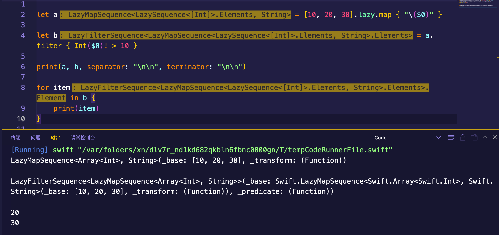

## 分析Swift利器

> swiftc xxx.swift -emit-silgen | xcrun swift-demangle > xxxxSILGen.sil

## 值类型线程安全？

不要人云亦云，这个说法是有问题的，细想一下，假如我们有个变量 `var i = 1`，多线程修改时不需要加锁？

在未优化状态下值类型其实默认是在堆上分配的，只是在`SIL`优化阶段，编译器会根据上下文把大部分值类型改为在栈上分配，在栈上分配的情况是才是线程安全的，因为每个线程都有自己的栈空间，不需要考虑线程安全问题。但是对于被捕获的这种情况是没办法优化的，你想想如果放到栈上在出作用域后不就被释放了嘛，所以这种情况不会优化到栈上，而是继续留在堆上，也就是说这种场景下多线程操作值类型是不安全的，需要加锁来防止数据竞争。

那值类型的安全性体现在哪里呢？

1. 显式捕获：这种情况会发生值类型的拷贝操作，即生成一份新的变量，所以是安全的

2. 函数传参时值类型会发生拷贝，所以是安全的

3. `let` 标记的变量是不允许修改的，所以这种也是安全的

## 闭包

`OC`中的`block`默认会捕获外界变量，我们要想修改捕获的值需要添加`__block`。 但Swift不一样，Swift中默认是可以修改外界捕获的变量的，除非你显式捕获外界变量。

这是为什么呢？原因是`Swift`捕获外界上下文变量时会在堆上开辟一块内存`project_box`，然后上下文变量会被包装成`project_box`(先被`HeapObject`包装一下，`HeapObject`再被`Box`包装一下，最后捕获的是`Box`，即**捕获的上下文存储在堆空间**)，这个`project_box`会被放到闭包的参数列表后面传递进来。变量属于是被间接捕获的，有点类似于`OC`中的`__block`原理。当然，并不是所有的外界变量捕获都是经过包装过的，只有在闭包内发生修改的变量才会被包装。

```swift
 struct HeapObject {
    var Kind: UInt64
    var refcount: UInt64
 }
 
 // 负责包装的结构体,也就是用来包装捕获需要更新的值
 struct Box {
    var refCounted: HeapObject
    // 这个捕获的值的类型根据捕获的值进行分配，此处规范操作是写泛型
    // var value: Int
    var value: <T>
}
 ```

而显式捕获，比如捕获全局变量的场景，经过编译后可以发现，其实是把被捕获的变量作为闭包函数的参数放到了原有闭包函数的后面，而值类型的函数参数在传参过程中会发生拷贝操作。


## Lazy

这里的`lazy`指的是高阶函数前面的`lazy`，而非属性声明中的`lazy`。

使用`lazy`后再执行高阶函数，返回的其实是一个`lazy`对象，比如对一个数组进行`XX`操作，返回的是 `LazyXXSequence` 类型，这个类型中会保存原函数的操作行为和原始数据，只有在对这个`lazy`类型进行操作时才会真正进行函数操作。




## Weak机制

`Swift`中`weak`与`Objective-C`中的`weak`实现机制不太一样，`Objective-C`中是不允许在一个对象释放过程中再被弱引用的，而`Swift`却没有这个限制。

`Swift`中的弱引用并没有和`Objective-C`一样放在全局的`side table`表中（Swift也不存在这个全局`side table`），而是由自身结构中的 `InlineRefCounts refCounts`来管理，这样效能会比`Objective-C`那种查表的方式高一些。

`Swift`[对象基本结构](https://github.com/apple/swift/blob/main/stdlib/public/SwiftShims/swift/shims/HeapObject.h)如下：

```cpp
// The members of the HeapObject header that are not shared by a
// standard Objective-C instance
#define SWIFT_HEAPOBJECT_NON_OBJC_MEMBERS       \
  InlineRefCounts refCounts

/// The Swift heap-object header.
/// This must match RefCountedStructTy in IRGen.
struct HeapObject {
  /// This is always a valid pointer to a metadata object.
  HeapMetadata const *__ptrauth_objc_isa_pointer metadata;

  SWIFT_HEAPOBJECT_NON_OBJC_MEMBERS;

#ifndef __swift__
  HeapObject() = default;

  // Initialize a HeapObject header as appropriate for a newly-allocated object.
  constexpr HeapObject(HeapMetadata const *newMetadata) 
    : metadata(newMetadata)
    , refCounts(InlineRefCounts::Initialized)
  { }
  
  // Initialize a HeapObject header for an immortal object
  constexpr HeapObject(HeapMetadata const *newMetadata,
                       InlineRefCounts::Immortal_t immortal)
  : metadata(newMetadata)
  , refCounts(InlineRefCounts::Immortal)
  { }

#ifndef NDEBUG
  void dump() const SWIFT_USED;
#endif

#endif // __swift__
};
```

`Swift` 引用计数的存储结构在[RefCount 头文件](https://github.com/apple/swift/blob/main/stdlib/public/SwiftShims/swift/shims/RefCount.h) 有介绍：

```swift
  //Strong and unowned variables point at the object.
  //Weak variables point at the object's side table.


  //Storage layout:

  HeapObject {
    isa
    InlineRefCounts {
      atomic<InlineRefCountBits> {
        strong RC + unowned RC + flags
        OR
        HeapObjectSideTableEntry*
      }
    }
  }

  HeapObjectSideTableEntry {
    SideTableRefCounts {
      object pointer
      atomic<SideTableRefCountBits> {
        strong RC + unowned RC + weak RC + flags
      }
    }   
  }
```

一般情况下`Swift`引用类型的对象结构中的`InlineRefCounts`并不会开辟`HeapObjectSideTableEntry`内存，只有在创建`weak`引用时，会先把对象的引用计数放到新创建的`HeapObjectSideTableEntry`中去，再把空出来的空间存放 `HeapObjectSideTableEntry` 的地址，而 `runtime` 会通过一个标志位来区分对象是否有 `HeapObjectSideTableEntry`。

对象的生命周期在 [RefCount 头文件](https://github.com/apple/swift/blob/main/stdlib/public/SwiftShims/swift/shims/RefCount.h) 中也有详细的说明：

```swift
  Object lifecycle state machine:

  LIVE without side table
  The object is alive.
  Object's refcounts are initialized as 1 strong, 1 unowned, 1 weak.
  No side table. No weak RC storage.
  Strong variable operations work normally. 
  Unowned variable operations work normally.
  Weak variable load can't happen.
  Weak variable store adds the side table, becoming LIVE with side table.
  When the strong RC reaches zero deinit() is called and the object 
    becomes DEINITING.

  LIVE with side table
  Weak variable operations work normally.
  Everything else is the same as LIVE.

  DEINITING without side table
  deinit() is in progress on the object.
  Strong variable operations have no effect.
  Unowned variable load halts in swift_abortRetainUnowned().
  Unowned variable store works normally.
  Weak variable load can't happen.
  Weak variable store stores nil.
  When deinit() completes, the generated code calls swift_deallocObject. 
    swift_deallocObject calls canBeFreedNow() checking for the fast path 
    of no weak or unowned references. 
    If canBeFreedNow() the object is freed and it becomes DEAD. 
    Otherwise, it decrements the unowned RC and the object becomes DEINITED.

  DEINITING with side table
  Weak variable load returns nil. 
  Weak variable store stores nil.
  canBeFreedNow() is always false, so it never transitions directly to DEAD.
  Everything else is the same as DEINITING.

  DEINITED without side table
  deinit() has completed but there are unowned references outstanding.
  Strong variable operations can't happen.
  Unowned variable store can't happen.
  Unowned variable load halts in swift_abortRetainUnowned().
  Weak variable operations can't happen.
  When the unowned RC reaches zero, the object is freed and it becomes DEAD.

  DEINITED with side table
  Weak variable load returns nil.
  Weak variable store can't happen.
  When the unowned RC reaches zero, the object is freed, the weak RC is 
    decremented, and the object becomes FREED.
  Everything else is the same as DEINITED.

  FREED without side table
  This state never happens.

  FREED with side table
  The object is freed but there are weak refs to the side table outstanding.
  Strong variable operations can't happen.
  Unowned variable operations can't happen.
  Weak variable load returns nil.
  Weak variable store can't happen.
  When the weak RC reaches zero, the side table entry is freed and 
    the object becomes DEAD.

  DEAD
  The object and its side table are gone.
```

简单翻译过来就是：

1. **LIVE**阶段：

    在给对象添加`weak`引用时，创建`side table`，把弱引用计数放到其中，强引用计数和无主引用计数也会挪到这里，在强引用计数变为`0`时调用`deinit()`析构函数，然后这个对象被标记为**DEINITING**；

2. **DEINITING**阶段（对象正在析构）：

    a. 没有弱引用：

        i. 再强引用此对象不会发生任何效果，即什么都不做(OC中也是如此)；
        ii. 通过无主引用加载此对象会发生`abort`；
        iii. 可以正常新增对此对象的无主引用;
        iv. 新增weak引用会指向nil

    在`deinit()`析构函数执行结束会调用`swift_deallocObject`函数，内部会执行`canBeFreedNow()`进行检查，如果没有无主引用和弱引用，则这个对象会被立即释放并且变为`DEAD`状态，否则，无主引用计数`-1`，变为**DEINITED**状态。

    b. 存在弱引用：

        i. 通过`weak`获取对象或者新增`weak`指向对象都不会有问题，它们都会指向`nil`；

    这种情况`canBeFreedNow()`必定返回`false`，然后无主引用计数`-1`，变为**DEINITED**状态。        
    
2. **DEINITED**阶段（对象析构完成，强引用计数变为0，但是存在无主引用）：

    a. 没有弱引用：
        i. 通过无主引用加载此对象会发生abort；

    当无主引用计数变为`0`的时候会真正释放此对象的内存，然后变为**DEAD**状态。

    b. 存在弱引用：
        i. 通过`weak`获取对象得到`nil`；

    当无主引用计数变为`0`的时候会真正释放此对象的内存，弱引用计数`-1`，对象变为**FREED**状态。 

3. **FREED**阶段（对象已释放，但是存在弱引用，即`side table`）：

    a. 当弱引用计数变为`0`，则释放`side table entry`，然后对象变为**DEAD**。

3. **DEAD**阶段：

    对象和它的`side table`都被释放了。


## struct

#### 嵌套类型会影响父级结构的内存占用吗？

不会。最简单的验证方法就是通过`MemoryLayout<Type>.size`打印一下父级结构所占内存大小就清楚了。也就是说嵌套只是起到了命名空间的作用，并不会影响其他东西

#### `Array`存`Any`类型的元素是怎么内存对齐的？

元素会被包装成`existential`类型，初步猜测应该和数组中存放遵守相同协议的元素的处理方式类似。

下面截取函数原型为`arr.append(1); arr.append((100, 200)); arr.append(XX());`的部分`SIL`代码，注意里面的`init_existential_addr`字眼：

```c
store %6 to %3 : $*Array<Any>                   // id: %7
%8 = alloc_stack $Any                           // users: %17, %15, %11
%9 = integer_literal $Builtin.Int64, 1          // user: %10
%10 = struct $Int (%9 : $Builtin.Int64)         // user: %12
%11 = init_existential_addr %8 : $*Any, $Int    // user: %12
store %10 to %11 : $*Int                        // id: %12
%13 = begin_access [modify] [dynamic] %3 : $*Array<Any> // users: %16, %15
// function_ref Array.append(_:)
%14 = function_ref @Swift.Array.append(__owned A) -> () : $@convention(method) <τ_0_0> (@in τ_0_0, @inout Array<τ_0_0>) -> () // user: %15
%15 = apply %14<Any>(%8, %13) : $@convention(method) <τ_0_0> (@in τ_0_0, @inout Array<τ_0_0>) -> ()
end_access %13 : $*Array<Any>                   // id: %16
dealloc_stack %8 : $*Any                        // id: %17
%18 = alloc_stack $Any                          // users: %32, %30, %19
%19 = init_existential_addr %18 : $*Any, $(Int, Int) // users: %21, %20
%20 = tuple_element_addr %19 : $*(Int, Int), 0  // user: %24
%21 = tuple_element_addr %19 : $*(Int, Int), 1  // user: %27
%22 = integer_literal $Builtin.Int64, 100       // user: %23
%23 = struct $Int (%22 : $Builtin.Int64)        // user: %24
store %23 to %20 : $*Int                        // id: %24
%25 = integer_literal $Builtin.Int64, 200       // user: %26
%26 = struct $Int (%25 : $Builtin.Int64)        // user: %27
store %26 to %21 : $*Int                        // id: %27
%28 = begin_access [modify] [dynamic] %3 : $*Array<Any> // users: %31, %30
// function_ref Array.append(_:)
%29 = function_ref @Swift.Array.append(__owned A) -> () : $@convention(method) <τ_0_0> (@in τ_0_0, @inout Array<τ_0_0>) -> () // user: %30
%30 = apply %29<Any>(%18, %28) : $@convention(method) <τ_0_0> (@in τ_0_0, @inout Array<τ_0_0>) -> ()
end_access %28 : $*Array<Any>                   // id: %31
dealloc_stack %18 : $*Any                       // id: %32
%33 = alloc_stack $Any                          // users: %43, %41, %37
%34 = metatype $@thick XX.Type                  // user: %36
// function_ref XX.__allocating_init()
%35 = function_ref @A.XX.__allocating_init() -> A.XX : $@convention(method) (@thick XX.Type) -> @owned XX // user: %36
%36 = apply %35(%34) : $@convention(method) (@thick XX.Type) -> @owned XX // user: %38
%37 = init_existential_addr %33 : $*Any, $XX    // user: %38
store %36 to %37 : $*XX                         // id: %38
%39 = begin_access [modify] [dynamic] %3 : $*Array<Any> // users: %42, %41
  ```


## 枚举

### 内存占用

1. 普通的枚举（非关联类型）自身只占用`1个字节`，与`case`数量无关；
2. 带关联值的枚举，其所占内存大小为所有`case`中关联类型占用内存最大的那个(类似`union`)，再加枚举自身的大小；
3. 特殊场景：只有一个`case`的枚举，枚举本身所占用的内存大小是`0个字节`，如果带关联值，那枚举所占内存大小只包含关联值所占内存的大小，不包含枚举自身的大小；
4. 对于有关联值的`case`，它的`case`值会根据定义的顺序默认从`0`开始累加`1`；而其余所有不带关联值的`case`，它们的`case`地址相同，都等于最后一个带关联成员`case`的值`+1`（也就是说不带关联值的`case`在带关联值的`case`后面）；
5. **关联值**是直接存储在枚举变量内存里面的，而**原始值**不是，它是通过`xx.rawValue`（计算属性）访问的，因此它的原始值完全不需要存储（枚举也不支持存储属性），而是在计算属性函数的返回值中，即函数中。`rawValue`这个计算属性是编译器帮我们默认添加的，它的返回值默认是我们设置的**原始值**，假如我们自己实现了这个计算属性，编译器就不会帮我们默认添加了，而是使用我们自己的实现；
6. 嵌套枚举：被`indirect`标记的对象会被`BoxPair`包装成引用类型（放到堆上），和`Rust`一样的处理方式（`Rust`中是被包装成`Box`类型）；


## 参考文章

- [从 SIL 角度看 Swift 中的值类型与引用类型](https://juejin.cn/post/7030983921328193549)

- [从 SIL 看 Swift 函数派发机制](https://mp.weixin.qq.com/s/KvwFyc1X_anTt-DTw86u7Q)

- [iOS下的闭包下篇-Closure](https://mp.weixin.qq.com/s/97Ij2N545ydx6WBNAwncOA)

- [Swift 性能优化(2)——协议与泛型的实现](http://chuquan.me/2020/02/19/swift-performance-protocol-type-generic-type/)

- [Swift 泛型底层实现原理](http://chuquan.me/2020/04/20/implementing-swift-generic/)
