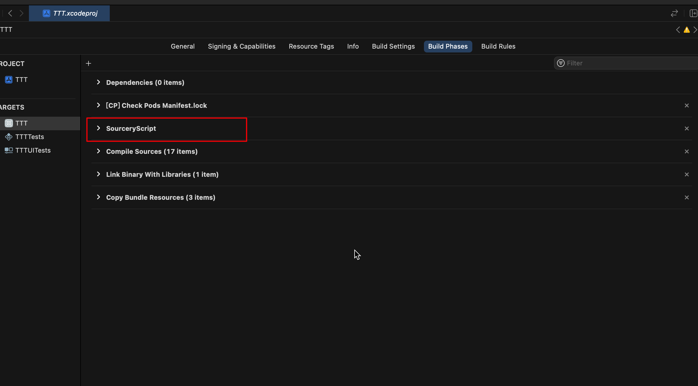
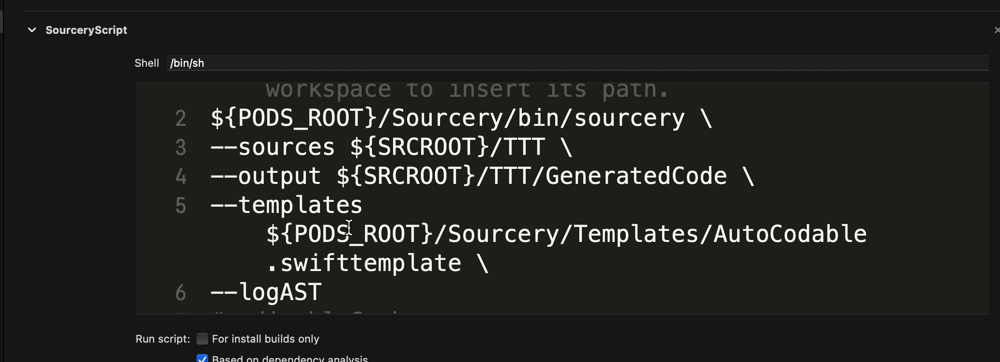
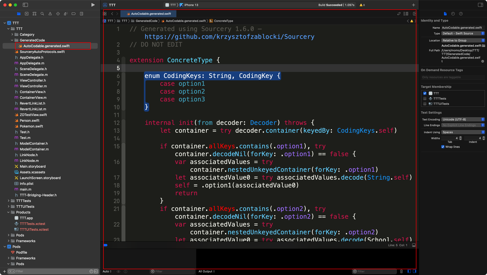

# Swift元编程 - Sourcery

## 什么是元编程

很多人可能对元编程（`meta-programming`）这个概念比较陌生，当然有一部分是因为翻译的问题，这个“元”字看起来实在是云里雾里。如果用一句话来解释，所谓元编程就是用代码来生成代码。

这句话可以从两个层面上来理解：

- 在运行时通过反射之类的技术来动态修改程序自身的结构。比如说我们都非常熟悉的`Objective-C Runtime`。
- 通过`DSL`来生成特定的代码，这通常发生在编译期预处理阶段。

## Sourcery

`Sourcery` 是一个 `Swift` 代码生成的开源命令行工具，它 (通过 `SourceKitten`) 使用 `Apple` 的 `SourceKit` 框架，来分析你的源码中的各种声明和标注，然后套用你预先定义的 Stencil 模板 (一种语法和 `Mustache` 很相似的 `Swift` 模板语言) 进行代码生成。我们下面会先看一个使用 `Sourcery` 最简单的例子，来说明如何使用这个工具。然后再针对我们的字典转换问题进行实现。

安装 `Sourcery` 非常简单，`brew install sourcery` 即可。不过，如果你想要在实际项目中使用这个工具的话，我建议直接从发布页面下载二进制文件，放到 `Xcode` 项目目录中，然后添加 `Run Script` 的 `Build Phase` 来在每次编译的时候自动生成。

## 接入

`homebrew`或者`CocoaPods`安装

脚本设置：

> sourcery脚本需要设置到编译脚本前面，否则会发生编译报错。
> 具体原因，思考一下就会明白，肯定是先要生成代码再编译啊，此时代码不全，编译肯定报错






## 使用

大家都知道`Swift`中使用`Codeable`做`JSON`到`Model`的映射非常繁琐，需要写很多模版代码，下面我们就以`Codable`做例子来演示：

首先声明一个协议
```swift
protocol AutoDecodable: Decodable {}
protocol AutoEncodable: Encodable {}
protocol AutoCodable: AutoDecodable, AutoEncodable {}
```

然后让我们的`class`或者`struct` `model`遵守`AutoCodable`

```swift
struct School: AutoCodable {
    var name: String
}

enum ConcreteType: AutoCodable {
    case option1(String)
    case option2(School)
    case option3(String, School, Int)
}

class ClassModel: AutoCodable {
    var data1: String
    var data2: ConcreteType
    
    // sourcery:inline:ClassModel.AutoCodable
    required init(from decoder: Decoder) throws {
        let container = try decoder.container(keyedBy: CodingKeys.self)
        data1 = try container.decode(String.self, forKey: .data1)
        data2 = try container.decode(ConcreteType.self, forKey: .data2)
    }
    // sourcery:end
}
```

编译，然后就会生成Codable代码：



```swift
// Generated using Sourcery 1.6.0 — https://github.com/krzysztofzablocki/Sourcery
// DO NOT EDIT

extension ConcreteType {

    enum CodingKeys: String, CodingKey {
        case option1
        case option2
        case option3
    }

    internal init(from decoder: Decoder) throws {
        let container = try decoder.container(keyedBy: CodingKeys.self)

        if container.allKeys.contains(.option1), try container.decodeNil(forKey: .option1) == false {
            var associatedValues = try container.nestedUnkeyedContainer(forKey: .option1)
            let associatedValue0 = try associatedValues.decode(String.self)
            self = .option1(associatedValue0)
            return
        }
        if container.allKeys.contains(.option2), try container.decodeNil(forKey: .option2) == false {
            var associatedValues = try container.nestedUnkeyedContainer(forKey: .option2)
            let associatedValue0 = try associatedValues.decode(School.self)
            self = .option2(associatedValue0)
            return
        }
        if container.allKeys.contains(.option3), try container.decodeNil(forKey: .option3) == false {
            var associatedValues = try container.nestedUnkeyedContainer(forKey: .option3)
            let associatedValue0 = try associatedValues.decode(String.self)
            let associatedValue1 = try associatedValues.decode(School.self)
            let associatedValue2 = try associatedValues.decode(Int.self)
            self = .option3(associatedValue0, associatedValue1, associatedValue2)
            return
        }
        throw DecodingError.dataCorrupted(.init(codingPath: decoder.codingPath, debugDescription: "Unknown enum case"))
    }

    internal func encode(to encoder: Encoder) throws {
        var container = encoder.container(keyedBy: CodingKeys.self)

        switch self {
        case let .option1(associatedValue0):
            var associatedValues = container.nestedUnkeyedContainer(forKey: .option1)
            try associatedValues.encode(associatedValue0)
        case let .option2(associatedValue0):
            var associatedValues = container.nestedUnkeyedContainer(forKey: .option2)
            try associatedValues.encode(associatedValue0)
        case let .option3(associatedValue0, associatedValue1, associatedValue2):
            var associatedValues = container.nestedUnkeyedContainer(forKey: .option3)
            try associatedValues.encode(associatedValue0)
            try associatedValues.encode(associatedValue1)
            try associatedValues.encode(associatedValue2)
        }
    }

}
```

有了这个神器，以后我们就不用自己写`codable`代码了，大大减少了我们的开发时间。

需要注意的是，并不是什么时候都会生成代码，因为对于比较简单的场景`Xcode`编译就能默认帮我们生成一些映射，此种情况`sourcery`也不会帮我们生成任何东西，只有缺东西才会帮我们生成，是不是很神奇?!

## 引用：

- [Sourcery](https://merowing.info/Sourcery/codable.html)
- [Sourcery-github](https://github.com/krzysztofzablocki/Sourcery)
- [Sourcery - Swift元编程实践，告别样板代码](https://www.jianshu.com/p/3815dbd928fb)
