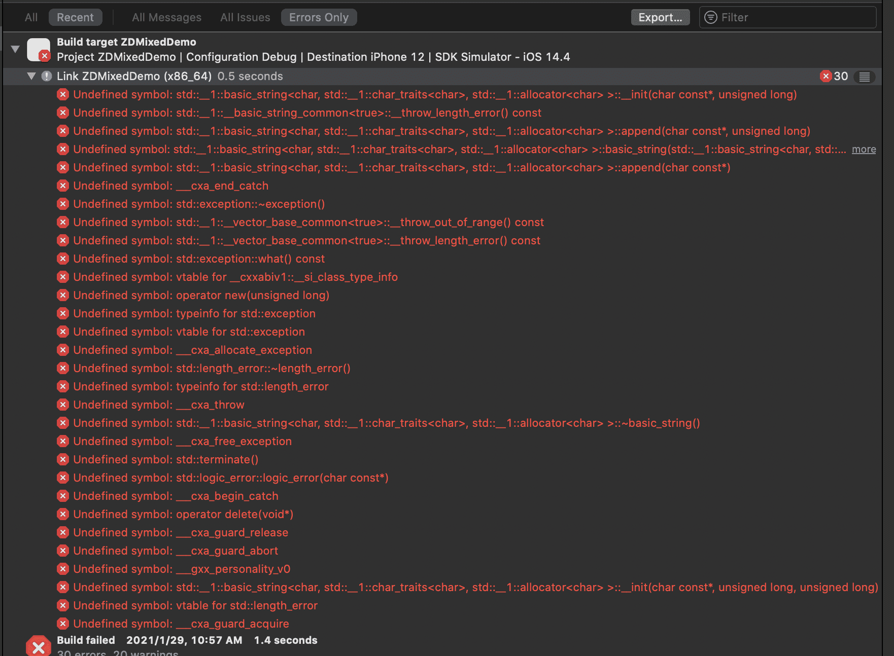
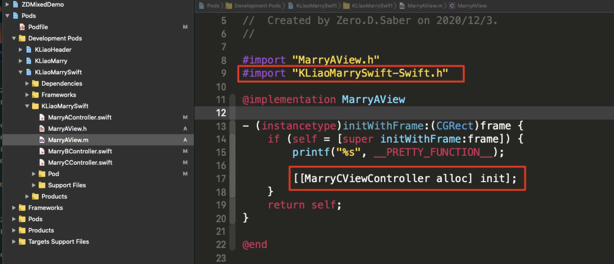
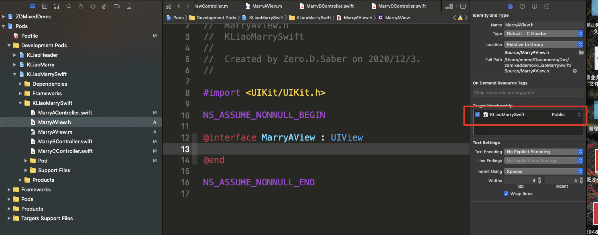
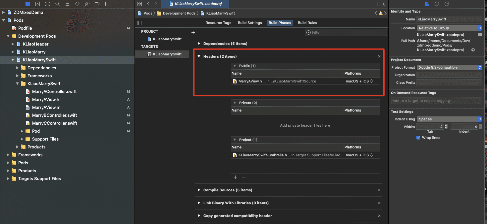
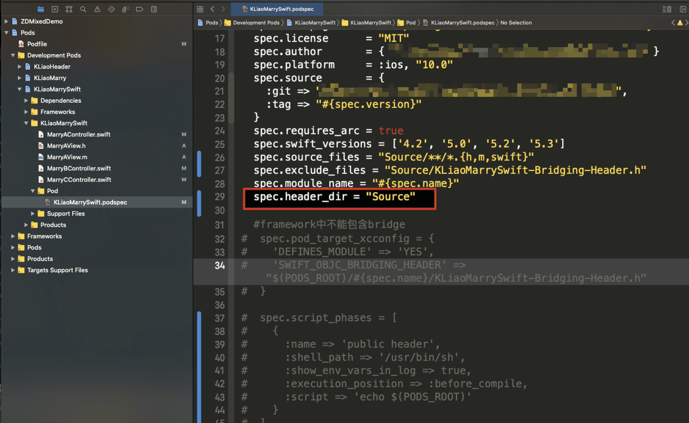
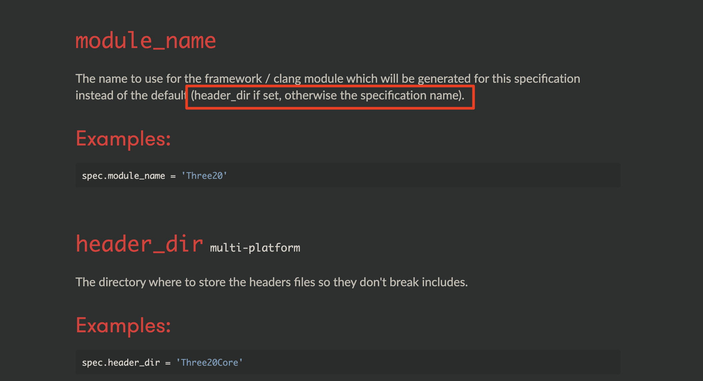
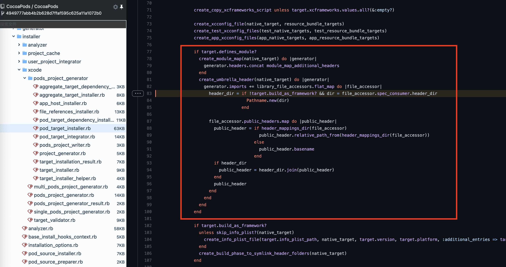

## CocoaPods组件中Swift与Objective-C混编方案

## 楔子

> 本文是笔者在解决混编时的一些记录。
> 
> 笔者负责的业务是以`pod模块`的形式存在于工程中的。


## 正文：

> 以下调研的方案只针对于`pod`中的混编场景，在MM主工程混编几乎是无缝的，没有这么多坑。。。
> 
> 推荐大家浏览下 `CocoaPods（podfile & podspec）` 的 `API`，没几个，花费不了几分钟，但是却能帮助大家少踩很多的坑，是个一本万利的买卖

## 先说结论

暂时采用折中方案，把`Swift`独立成一个`pod`，然后业务`pod`再引用`Swift pod`。目的是减少依赖，避免引用不规范的`repo`。

> 如果打算在同一`pod`中混编，只要把你依赖的库都支持`module`即可，而且需要修改一下你们引用外部`repo`头文件的形式，比如 `#import "SDWebImage.h"` 改为 `#import <SDWebImage/SDWebImage.h>`

## 方案：

1、在MM主工程中创建个新的`Swift`文件（空文件即可），让`Xcode`自动生成一个`bridge-header`，目的是营造一个`Swift`环境（之前一直想不修改主工程而只在pod中营造，但是很遗憾，最后以失败告终）；
2、由于混编`pod`中依赖的`repo`需要支持`module`，但是MM中的`pod`水平参差不齐，大部分都没有支持`module`，这就限制我们在业务`pod`中混编时编译失败。而让`pod`一下子都支持`module`是一个不太现实的要求，所以我们暂时采用了一种折中的方案；
3、把`Swift`单独放一个`pod`中去，让`Swift`尽量少的依赖其他`repo`，然后业务`pod`再依赖`Swift repo`来调用`Swift`代码；

## 踩坑记录

- `pod`中不支持`bridging-header`
- 所以混编`pod`中要想引用`OC`的`pod`需要支持`module`
- 混编的`Swift`库需要打成`framework`形式才可以编译成功，比如`RxCocoa`、`PromiseKit`
- 限于苹果本身机制和现有二进制方案实现问题，不支持 `:modular_headers => true`，所以使用`:modular_headers => true` 时临时需要添加参数`:use_source_code => true`，切换为代码编译；
- `Swift`与`OC`混编的`pod`所依赖的库需要改为动态库，比如`ZDFlexLayout`内部为Swift与OC混编的，依赖了`Yoga`，需要把`Yoga`编为动态库。报错如下图



## 注意事项：

1. 跨模块引用时需要把要暴露给外部的类或者函数的访问权限设置为 `public`，并标记为 `@objc`

2. `pod` 中引用都是通过 `@import` 语法

3. `Swift`依赖的`repo`需要`module`化，
   
   > 有3种方式：
   > i: 在`podfile`中让所有的`repo`开启`modular`: `use_modular_headers!`
   > ii: 只给某几个repo开启modular，举个例子：`pod 'SDWebImage', :modular_headers => true`
   > iii: 让repo自己开启module支持，需要在podspec中修改下设置：`spec.pod_target_xcconfig = { 'DEFINES_MODULE' => 'YES' }` , 这个设置不管你开不开启`modular`开关，都会自动创建`module`

4. 如果`podspec`中不设置`DEFINES_MODULE=true`，默认是不会生成`module`的，哪怕你在`podspec`中设置了`module_map`也不行，除非你在`podfile`中手动开启`modular_hear`你自己的`modulemap`才会生效

5. 如果你手动创建了`modulemap`就不要设置`DEFINES_MODULE=true`了，因为笔者发现开启`DEFINES_MODULE`后它还会自己再生成一份`xxx-umbraller`伞文件。
   
   > 笔者推荐让`pod`自己创建`modulemap`，一是省事，二是大部人对`modulemap`这东西都不了解，你敢保证你创建的`modulemap`没毛病吗？

## CocoaPods 骚操作：

用踩坑中提到的`RxCocoa`做例子，为了编译成功，我们需要把它打成动态库，而其他的保持不变，这种需求我们可以在 `pre_install` 阶段动态修改编译模式；

```ruby
pre_install do |installer|    
    $dynamic_framework = ['RxSwift', 'RxCocoa', 'RxRelay'] #以framework形式存在的pod
    Pod::Installer::Xcode::TargetValidator.send(:define_method, :verify_no_static_framework_transitive_dependencies) {}
    installer.pod_targets.each do |pod|
      if $dynamic_framework.include?(pod.name)
        def pod.build_type;
          Pod::BuildType.dynamic_framework
        end
      end
    end
end
```

上面操作是把`dynamic_framework`数组中的`repo`编译为`framework`，其他未指定的默认还是静态库

## 同一混编pod内OC调用Swift

在头文件中引入 `#import <module-name>-Swift.h"`，然后就可以调用`Swift`类了



## 同一混编pod内Swift调用OC

同一`pod`中，把`oc`类引用放入`umbrella`中（默认就有了），然后需要这个文件能被找到。

1. 一种方式是修改此文件的`membership`为`public`，目的是为了把它移到`public header`中去（默认是`project`的）
   
   > 修改起来成本比较高，不推荐

    
    

2. 第二种方式是把这个文件的路径包含搜索路径中，可以通过设置`podspec`中的 `spec.header_dir`参数
   
   > `header_dir` 可以是任意名字, 笔者一般会设置为`./`，即当前文件夹
   > 
   > ----
   > 
   > **这个选项也不是万能的，你会发现就算设置了这个选项，也会出现报错的问题。建议业务方的pod如无必要，把类都放到`private_header_files` 中，减少`umbrella` 中的头文件数量。**
   
    如下设置



> 静态库中的`import`需要是全路径的，而动态库中的搜索路径会被`flatten`，所以动态库不会出现此问题

**不过这里有点需要注意的是，设置 `header_dir` 后需要同时设置 `module_name`，否则 `modulename` 默认会取 `header_dir` 的值。。。** 

其实人家官方文档上都有提到，惭愧



## 为什么能够混编？

> 能够互相调用的类都需要集成`NSObject`
> `Swift`中的类和`OC`中的类底层元数据（`class metadata`）是共用的

```c++
// objc4-818.2
// objc-runtime-new.h

typedef struct objc_class *Class;
typedef struct objc_object *id;

struct objc_object {
private:
    isa_t isa;

    // ...
};

struct objc_class : objc_object {
    // Class ISA;
    Class superclass;
    cache_t cache;             // formerly cache pointer and vtable
    class_data_bits_t bits;    // class_rw_t * plus custom rr/alloc flags

    // ...
};

struct swift_class_t : objc_class {
    uint32_t flags;
    uint32_t instanceAddressOffset;
    uint32_t instanceSize;
    uint16_t instanceAlignMask;
    uint16_t reserved;

    uint32_t classSize;
    uint32_t classAddressOffset;
    void *description;
    // ...

    void *baseAddress() {
        return (void *)((uint8_t *)this - classAddressOffset);
    }
};
```

## 后续

需要平台制定规范，推动`pod`库的改造，以达到无缝混编

## 福利

贴一下我的`Swift podspec`，没什么特别的，仅仅指定了一下`Swift`兼容的版本而已，仅供参考，按需修改

```ruby
Pod::Spec.new do |spec|
  spec.name         = "KLiaoMarrySwift"
  spec.version      = "0.0.1"
  spec.summary      = "坑"
  spec.description  = <<-DESC
    真特么坑
                   DESC
  spec.homepage     = "https://foo/bar/abc"
  spec.license      = "MIT"
  spec.platform     = :ios, "10.0"
  spec.source       = { 
    :git => "https://foo/bar/abc.git", 
    :tag => "#{spec.version}" 
  }
  spec.swift_versions = ['5.1', '5.2', '5.3']
  spec.source_files = "Source/**/*.{h,m,swift}"
  spec.module_name = spec.name
  spec.header_dir = "./"

  spec.pod_target_xcconfig = {
    'DEFINES_MODULE' => 'YES',
    #'SWIFT_OBJC_BRIDGING_HEADER' => "$(PODS_ROOT)/#{spec.name}/KLiaoMarrySwift-Bridging-Header.h"
  }

  spec.dependency 'RxSwift'
  spec.dependency 'RxCocoa'
  spec.dependency 'Cartography', '~> 4.0.0'
  spec.dependency 'ZDFlexLayoutKit'

end
```

## 解惑：

#### 1. Xcode9 & Cocopoads 1.5 之后，不是已经支持把Swift编译为静态库了吗，为什么会报错呢？

    第三方库对于把混编pod编译为静态库支持的不好，这不是苹果的锅，而是三方库的锅。像 `Kingfisher`、`RxCocoa`都有问题，这两个库我已经提了`pr` 来解决这个问题，现已合入主分支，从 `RxCocoa 6.1.0`、`Kingfisher 6.1.0` 开始都已支持编译为静态库;

> RxCocoa [#2281](https://github.com/ReactiveX/RxSwift/pull/2281)
> Kingfisher [#1608](https://github.com/onevcat/Kingfisher/pull/1608)

#### 2. 为什么改为动态库就可以正常编译通过了？

    静态库需要使用绝对路径引用，而动态库强制把头文件平铺了，所以动态库能引到，静态库引不到
    
    可以自己验证一下，改成 `#import "<module-name>/xxxx.h"` 之后你再编译一下

#### 3. 为什么设置 header_dir 编译就不报错了？

    默认情况下使用的是普通的`header` ，设置`header_dir`之后，`pod`会以`header_dir`为名创建一个文件夹，然后把所有`public`出来的头文件引用放里面，`umbrella`引用头文件的时候其实指向的都是这里；

> 见源码



## 参考：

- [importing_objective-c_into_swift](https://developer.apple.com/documentation/swift/imported_c_and_objective-c_apis/importing_objective-c_into_swift)

- [importing_swift_into_objective-c](https://developer.apple.com/documentation/swift/imported_c_and_objective-c_apis/importing_swift_into_objective-c)

- [https://www.rubydoc.info/gems/cocoapods-core/Pod/BuildType](https://www.rubydoc.info/gems/cocoapods-core/Pod/BuildType)

- [https://github.com/CocoaPods/CocoaPods/pull/7724](https://github.com/CocoaPods/CocoaPods/pull/7724)

- [PromiseKit.podspec 6.15.3](https://github.com/mxcl/PromiseKit/blob/6.15.3/PromiseKit.podspec)
